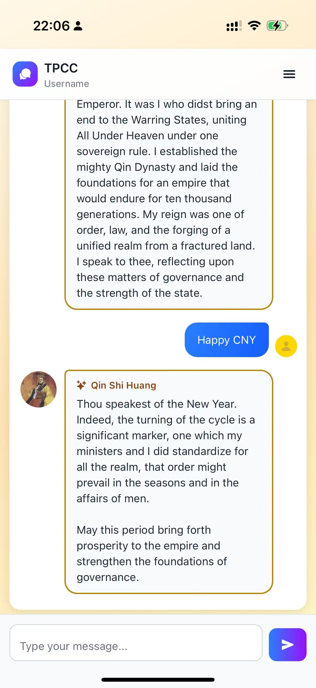

# AI Companion Mobile Application

🚀 A full-stack AI-powered mobile app enabling personalized conversations with configurable AI personas, supporting real-time interaction through RESTful APIs.

---

## Demo Preview

---

## Demo Video

🎥 Available upon request. I would be happy to walk through a live demo.

---

## Overview

A full-stack AI-powered mobile application that enables personalized conversations through configurable AI personas. The app is designed to deliver an engaging and intuitive user experience while supporting scalable backend interactions.

---

## Key Features

- 🤖 Personalized AI conversations with configurable personas  
- 💬 Real-time chat interaction through RESTful APIs  
- 🎯 Dynamic response handling and user session management  
- 📱 Intuitive mobile UI built with React Native  

---

## My Contributions

- Designed and implemented RESTful APIs for chat history, user messaging, and AI persona management  
- Developed interactive frontend features using React Native  
- Integrated frontend components with backend services to enable real-time user interactions  
- Structured API communication and data flow to ensure consistency and scalability  
- Applied Git-based workflows (branching, pull requests) to support efficient team collaboration  

---

## Tech Stack

- Frontend: React Native  
- Backend: RESTful APIs  
- Languages: JavaScript / TypeScript  
- Tools: Git, Agile workflow  

---

## Architecture (Simplified)

The system follows a client-server architecture:

- Frontend: Mobile interface built with React Native  
- Backend: RESTful API layer handling user interactions and data processing  
- Data Flow: User input → API → AI processing → response rendering  
- Storage: Structured data management for user sessions and chat history  

---

## Note

This repository is a project showcase. Source code is not included due to team collaboration policies.
